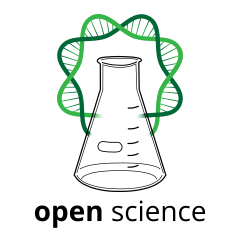

## :mortar_board: Open Science and Reproducibility 

[](https://choosealicense.com/licenses/cc-by-4.0/)


Code used to create the online presentation **Open Science and Reproducibility** available at:
[**rdatatoolbox.github.io/course-opensci**](https://rdatatoolbox.github.io/course-opensci)

<br />

:point\_right:  This course is part of the workshop :mortar_board: 
[**_Data Toolbox for Reproducible Research in Ecology_**](https://rdatatoolbox.github.io) co-organized by the 
[FRB-CESAB](https://www.fondationbiodiversite.fr/en/about-the-foundation/le-cesab/) 
and the 
[GdR EcoStat](https://sites.google.com/site/gdrecostat/).


<br />


### Usage

First install required R packages listed in the 
[`DESCRIPTION`](https://github.com/rdatatoolbox/course-opensci/blob/main/DESCRIPTION)
file.

```r
## Install 'remotes' package (if necessary) ----
install.packages("remotes")

## Install required packages ----
remotes::install_deps()
```

<br />

To contribute, edit the 
[`index.Rmd`](https://github.com/rdatatoolbox/course-opensci/blob/main/index.Rmd) 
file. To update the `html` presentation, run: 

```r
## Convert Rmd to html ----
rmarkdown::render("index.Rmd")
```


<br />


### Citation

> Casajus N, Dray S, Gimenez O, Guéry L, Guilhaumon F & Schiettekatte NMD (2021) *Workshop FRB-CESAB & GdR EcoStat: Data Toolbox for Reproducible Research in Computational Ecology*. Zenodo. <http://doi.org/10.5281/zenodo.4262978>.


<br />

#### Acknowledgement

The [logo](https://commons.wikimedia.org/wiki/File:Open_Science_Logo_v3.svg) used for this repository was made by D. Schindler & G. Emmerich and is
licensed under the [Creative Commons Attribution-Share Alike 3.0 Unported](https://creativecommons.org/licenses/by-sa/3.0/deed.en) license.
